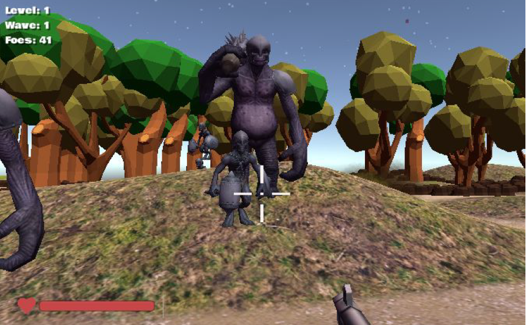

# N.I.K.A
An isometric 3D action survival game done in C# with Unity Engine and MonoDevelop.

Starting the game
----------------------------------------------------------------------------------------------------------------------------------------
The easiest way to play the game is on itch.io by following this link: https://alejandromromero.itch.io/not-in-kansas-anymore
Otherwise, please follow these steps:
Open the NotInKansasAnymore.exe file provided.
All files used by the .exe are in the same folder and need to remain in the
same folder to be used properly by the game. This will bring up the configuration menu.
Simply choose your desired resolution and graphics quality (We recommend Ultra) and
hit play!
Additionally, If you have Unity installed, you can play it through Unity with the provided
projectfolder. To do this, open Unity and then select the provided
NotInKansasAnymoreGame project folder. If you are not on the start menu, then go to
the Scenes folder within Assets folder and select the Level0 scene. Once you are on
the start menu scene, click on the play button to begin.

Controls
------------------------------------------------------------------------------------------------------------------------------------------
Movement (up, down, left, right): ‘ w’, ‘s’, ‘a’, ‘d’ keys
Movement (Turning Player): moving mouse over screen
Fire: left mouse click
Toggle first/third person view: ‘t’ key
Pause menu: ‘ p’ key
Menu navigation: mouse movement and left mouse click
